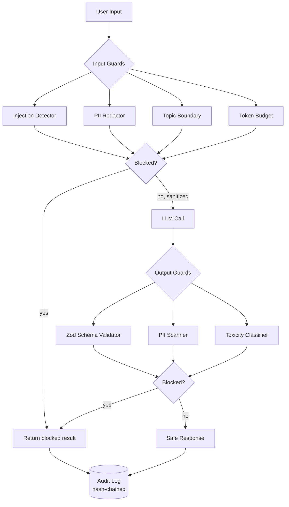
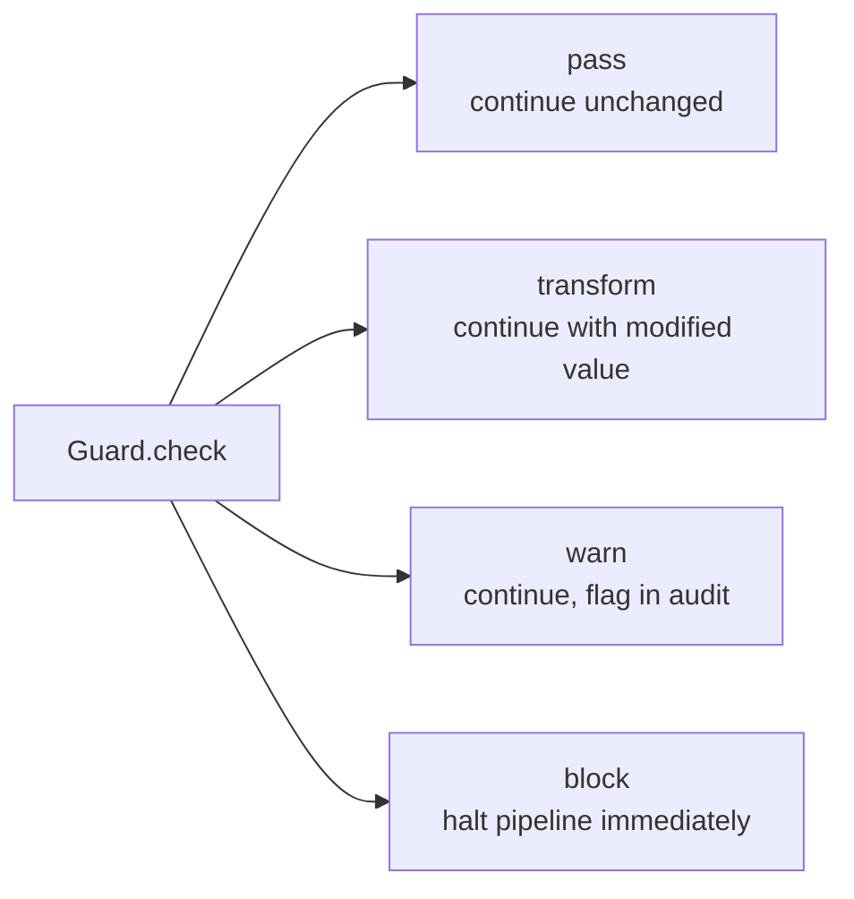

# guardrails-core

> AI safety layer: I/O validation, PII redaction, prompt injection detection, topic boundary enforcement, structured output validation (Zod), and tamper-evident audit logging.

[](https://www.typescriptlang.org/)
[](https://nodejs.org/)
[](LICENSE)
[](#project-status)

## Project Status

**Work in progress.** The guard pipeline, prompt injection detector, PII redactor (with CPF/CNPJ/Luhn checksum validation), and hash-chain audit logger are implemented. Toxicity classification and the PostgreSQL audit backend are in development. **No accuracy or latency numbers are published yet** — the Evaluation section describes how these guards should be measured, not measured results.

## Problem

LLM applications need defense in depth. Without guardrails:

- Users inject instructions that override system prompts
- PII flows into third-party model providers, and back out to other users
- Outputs drift into regulated territory (medical, legal, financial advice)
- Unstructured responses break downstream parsers at 3 AM
- When something goes wrong, there is no defensible audit trail

This library wraps any LLM call with configurable input and output guards, plus an append-only audit log with cryptographic integrity.

## Architecture



### Guard Decision Model

Every guard returns one of four actions, and the pipeline reacts accordingly:



This is why PII redaction and injection detection compose cleanly: redaction returns `transform` and rewrites the input, while injection returns `block` and stops execution. Guards run in order, and a `transform` feeds the modified value into the next guard.

## Features

### Prompt Injection Detection

Three independent signals, combined with weights `0.3 / 0.3 / 0.4`:

| Layer | Detects | Cost |
|-------|---------|------|
| **Pattern** | Known attack templates: instruction override, DAN/jailbreak, system prompt extraction | Very low (regex) |
| **Structural** | Instruction density, system-prompt markers, base64/hex/unicode encoding, zero-width characters | Low |
| **Semantic** | Role-play hijack phrasing, output manipulation, context-stuffing via repeated blocks | Medium |

Borderline scores (70–100% of threshold) return `warn` instead of `block`, so you can tune the threshold against real traffic without dropping legitimate requests.

### PII Redaction

Detection is not regex-only. Where a format has a checksum, it is validated, which eliminates the false positives that plague naive pattern matching:

| Entity | Validation |
|--------|-----------|
| CPF | Modulo-11 check digits (weights 10→2, then 11→2), rejects repeated-digit sequences |
| CNPJ | Modulo-11 with the standard two weight vectors |
| Credit card | Luhn algorithm (mod 10) |
| IP address | Octet range validation (0–255) |
| Email, phone | Pattern-based, Brazilian phone formats including +55 and 9-digit mobile |

Overlapping matches are deduplicated, and redaction is applied right-to-left so character offsets stay valid during replacement.

### Topic Boundaries

Allow-list and deny-list topic enforcement with pluggable classifiers, plus configurable deflection responses when a boundary is hit.

### Structured Output Validation

Zod schemas validate LLM output. On failure the guard can retry with the validation error fed back to the model, up to a configurable retry budget. Coercion is attempted before failing outright.

### Tamper-Evident Audit Log

Append-only log where each entry embeds the hash of its predecessor:

```
hash(entryₙ) = SHA-256( serialize(entryₙ) ‖ hash(entryₙ₋₁) )
hash(entry₀) = SHA-256( serialize(entry₀) ‖ 0×64 )
```

Modifying or deleting any historical entry breaks every subsequent hash, and `verify()` walks the chain to report the exact entry where integrity fails. PII in audit metadata is masked before storage by default, which matters for LGPD and GDPR.

## Installation

```bash
npm install @q1-digital/guardrails-core
```

## Quick Start

```typescript
import { Guardrails } from '@q1-digital/guardrails-core';
import { z } from 'zod';

const guard = new Guardrails({
  input: {
    injection: { enabled: true, threshold: 0.8 },
    pii: { enabled: true, action: 'redact', entities: ['email', 'cpf', 'phone'] },
    topics: { deny: ['medical-advice', 'legal-advice', 'financial-advice'] },
    tokenBudget: { max: 4096 },
  },
  output: {
    schema: z.object({
      answer: z.string().min(1),
      confidence: z.number().min(0).max(1),
      sources: z.array(z.string()).optional(),
    }),
    pii: { enabled: true, action: 'block' },
    maxRetries: 3,
  },
  audit: {
    enabled: true,
    storage: 'postgres',
    connectionString: process.env.AUDIT_DB_URL,
    maskPII: true,
  },
});

const result = await guard.execute({
  input: userMessage,
  fn: async (sanitizedInput) => llm.complete(sanitizedInput),
  metadata: { userId: 'u_123', endpoint: '/chat' },
});

if (result.blocked) {
  console.warn(result.reason);       // e.g. "injection: Prompt injection detected (91.2%)"
  console.warn(result.guardResults); // Full per-guard breakdown
} else {
  console.log(result.output);        // Schema-validated, PII-free
}
```

### Pre-flight Validation

```typescript
// Validate without calling the LLM, useful before opening a stream
const { valid, sanitized, results } = await guard.validateInput(userMessage);
if (!valid) return reject(results);
```

### Audit Verification and Statistics

```typescript
const integrity = await auditLogger.verify();
// { valid: true, entriesChecked: 14302 }
// or { valid: false, entriesChecked: 811, brokenAt: 1723... }

const stats = await auditLogger.stats({
  start: '2026-08-01T00:00:00Z',
  end: '2026-08-16T00:00:00Z',
});
// { total, blocked, blockRate, byGuard: { injection: { triggered, blocked } }, avgLatencyMs }
```

## Configuration

```typescript
interface GuardrailsConfig {
  input: {
    injection?: { enabled: boolean; threshold: number; customPatterns?: RegExp[]; allowList?: string[] };
    pii?: PIIConfig;
    topics?: { allow?: string[]; deny?: string[] };
    tokenBudget?: { max: number };
  };
  output: {
    schema?: z.ZodSchema;
    pii?: PIIConfig;
    toxicity?: { enabled: boolean; threshold: number };
    maxRetries?: number;
  };
  audit?: {
    enabled: boolean;
    storage: 'postgres' | 'memory';
    connectionString?: string;
    maskPII?: boolean;
    retentionDays?: number;
  };
}

interface PIIConfig {
  enabled: boolean;
  action: 'redact' | 'block' | 'warn';
  entities: PIIEntityType[];
  customPatterns?: Array<{ name: string; regex: RegExp; replacement?: string }>;
}

type PIIEntityType =
  | 'email' | 'phone' | 'cpf' | 'cnpj' | 'credit_card'
  | 'ip_address' | 'name' | 'address' | 'date_of_birth';
```

## Project Structure

```
src/
├── core/
│   ├── guardrails.ts             # Pipeline orchestrator
│   ├── config.ts                 # Zod configuration schemas
│   └── result.ts                 # Result types
├── guards/
│   ├── base.guard.ts             # Guard interface (pass/transform/warn/block)
│   ├── input/
│   │   ├── injection.guard.ts      # Three-layer injection detection
│   │   ├── pii-redactor.guard.ts   # Checksum-validated PII redaction
│   │   ├── topic.guard.ts
│   │   └── token-budget.guard.ts
│   └── output/
│       ├── schema.guard.ts         # Zod validation + retry feedback
│       ├── pii-scanner.guard.ts
│       └── toxicity.guard.ts
├── detectors/
│   ├── pii/                      # Patterns, checksum validators, redactor
│   ├── injection/                # Pattern, structural, semantic detectors
│   └── toxicity/
├── audit/
│   ├── logger.ts                 # Hash-chained append-only log
│   ├── hash-chain.ts             # Chain construction + verification
│   └── storage/                  # PostgreSQL, in-memory
└── index.ts
```

## Evaluation Methodology

Guards should be measured, not assumed. **No results are published yet.** The intended evaluation approach:

| Guard | Metric | Test Set |
|-------|--------|----------|
| Injection detection | Precision / recall / F1 | Labelled corpus of real injection attempts plus benign inputs that superficially resemble them |
| PII redaction | Recall (missed PII is the costly error) and false-positive rate | Synthetic documents with known PII positions, including invalid-checksum near-misses |
| Topic classification | F1 per category | Manually labelled in-domain and out-of-domain prompts |
| Schema validation | Deterministic, correctness by construction | Property-based tests over generated schemas |

For PII specifically, recall and precision must be reported separately. A redactor that masks everything has perfect recall and is useless.

## Design Decisions

**Why validate checksums instead of matching patterns alone?** An 11-digit number is not a CPF. Without modulo-11 validation, every order ID and separator-free phone number gets redacted, and users lose trust in the system. Checksum validation converts a noisy pattern matcher into a precise detector.

**Why redact right-to-left?** Replacing a match changes the length of the string, invalidating every offset after it. Processing matches in reverse order means earlier offsets are still correct when you reach them.

**Why does `warn` exist alongside `block`?** Because you cannot safely tune a detection threshold in production if the only options are silence and rejection. `warn` lets you observe what *would* have been blocked before you start enforcing it.

**Why is the guard interface `pass | transform | warn | block` rather than a boolean?** A boolean forces every guard to be a gate. Real guards do different things: redaction rewrites, budget enforcement truncates, detection rejects. Modelling the action explicitly lets guards compose in a single ordered pipeline.

**Why hash-chain the audit log instead of relying on database permissions?** Permissions protect against outsiders. A hash chain also detects modification by anyone with write access, including an administrator or a compromised service account.

## Roadmap

- [ ] Published evaluation results with methodology and test sets
- [ ] Multilingual PII detection (pt-BR extended, es, en)
- [ ] Streaming guards (validate token-by-token, halt mid-generation)
- [ ] PostgreSQL audit backend
- [ ] Custom guard plugin API
- [ ] Jailbreak simulation test suite for regression testing detection quality

## License

MIT
